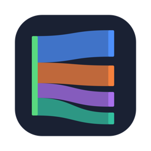
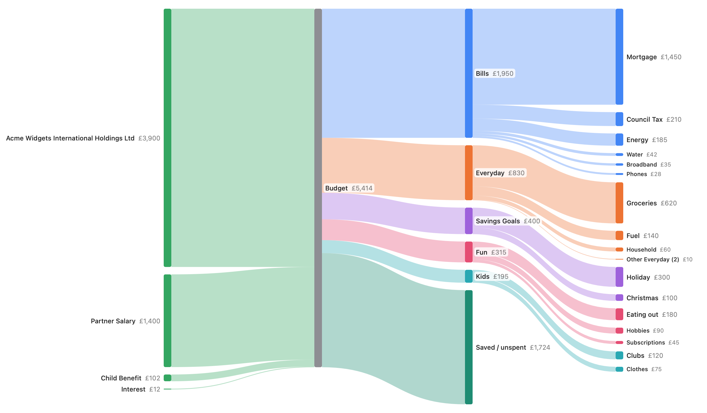
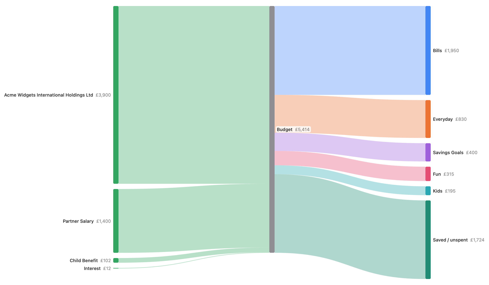

# YNAB Sankey

A macOS app that draws a month's or a year's spending from a [YNAB](https://www.ynab.com) budget as a
Sankey diagram:

**income sources → Budget → category groups (+ Saved) → categories**



With the category column turned off, you see just the category groups:



*Screenshots use synthetic test data (see `Tests/YNABSankeyTests/SnapshotTests.swift`), not a real budget.*

## Build & run

Requires macOS 14+ and Swift 6 (Xcode 16 or later).

```bash
scripts/build-app.sh            # builds build/YNAB Sankey.app
scripts/build-app.sh --install  # …and copies it to /Applications
swift test                      # unit tests
```

On first launch, paste a YNAB Personal Access Token (YNAB → Account Settings → Developer Settings →
New Token).

### Which budget it shows

The first time it connects, the app picks the budget you edited most recently in YNAB. If your
account has more than one budget, a **Budget** menu appears in the toolbar so you can switch. The
app remembers your choice and opens that budget next time. If the remembered budget is later deleted
or the token can't see it any more, it goes back to the most recently edited one.

## Using it

- **Month / Year** switches the period length; ⌘← / ⌘→ step between periods, or pick one from the menu.
- **Categories** toggles the right-hand category column.
- Hover a node or ribbon for its amount and share.
- Zoom with a trackpad pinch, the toolbar magnifiers, or ⌘= / ⌘- / ⌘0 (up to 400%). Zoomed in, the
  chart scrolls and crowded labels get room.
- ⌘R reloads from YNAB. Closing the window quits the app.

## How the numbers are worked out

- Only on-budget accounts count. Split transactions use their subtransactions.
- Income = anything categorised to *Inflow: Ready to Assign*, grouped by payee (top 6 + "Other income").
- Spending = net activity per category, so refunds reduce the category they're filed against.
- Transfers between your own on-budget accounts are ignored; categorised transfers to tracking
  accounts (e.g. pension, investments) count as spending.
- If income exceeds spending the difference flows to **Saved / unspent**; if spending exceeds
  income a **From savings / buffer** source makes up the difference.
- Categories under 0.6% of the period's spending fold into "Other <group>".

## How your access token is stored

A YNAB Personal Access Token gives full access to your YNAB account, so the app treats it as a
credential (see [`Keychain.swift`](Sources/YNABSankey/Keychain.swift)):

- **Kept only in the macOS Keychain.** It's saved as a generic password in your login keychain
  (service `com.markrwatts.YNABSankey`, account `ynab-personal-access-token`), which macOS stores
  encrypted and unlocks with your login. It's never written to a file, `UserDefaults`, logs, or
  anywhere in this repository.
- **Checked before it's saved.** The token is only stored after YNAB accepts it, so a typo never
  lands in the Keychain.
- **Only this app can read it silently.** The Keychain item's access list names this app by its code
  signature. If any other program asks for it, macOS prompts you first. Because the app is ad-hoc
  signed, a rebuilt copy counts as a different app, and macOS will ask once. Choose **Always Allow**.
- **Only ever sent to YNAB.** The token goes in the `Authorization: Bearer` header of HTTPS requests
  to `https://api.ynab.com/v1` and nowhere else. The app only makes read (GET) requests and never
  changes your budget.
- **Only on screen as dots.** The entry field is a secure text field, and the app never displays the
  token after it's saved.
- **Removed on disconnect.** **YNAB Sankey → Settings… → Disconnect** deletes the Keychain item. You
  can also inspect or delete it in Keychain Access (search for `com.markrwatts.YNABSankey`).

YNAB tokens don't expire on their own. If you think one has leaked, revoke it in YNAB's Developer
Settings and connect again with a new one.

## Development

To eyeball layout changes without a token, render the synthetic snapshots:

```bash
SANKEY_SNAPSHOT_DIR=docs/screenshots swift test --filter renderSnapshot
```

`scripts/make-icon.swift` regenerates `Resources/AppIcon.icns`.

## Licence

[GNU General Public License v3.0](LICENSE)
